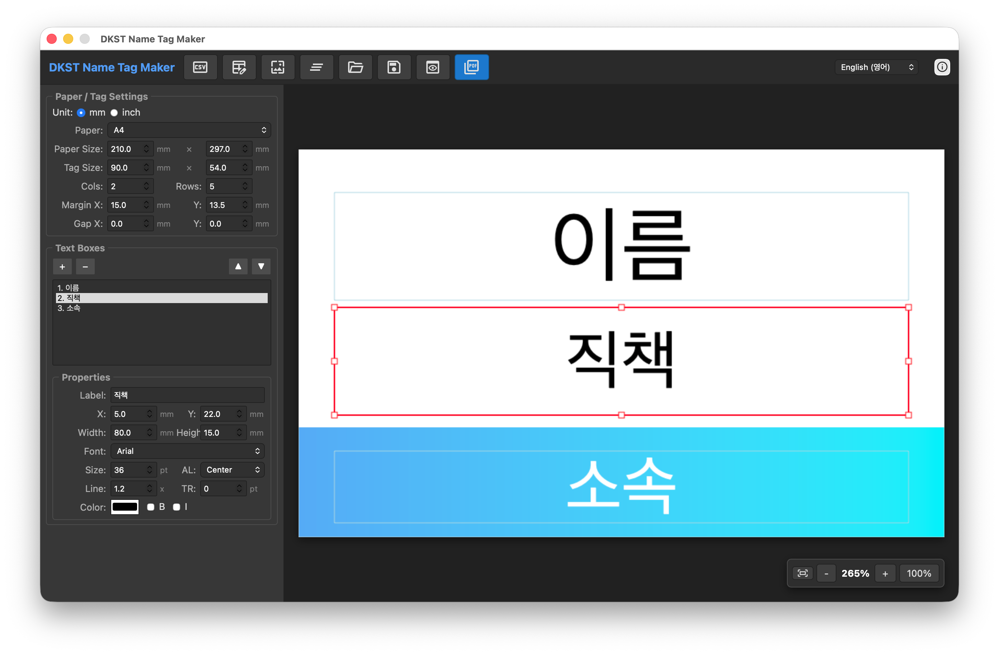
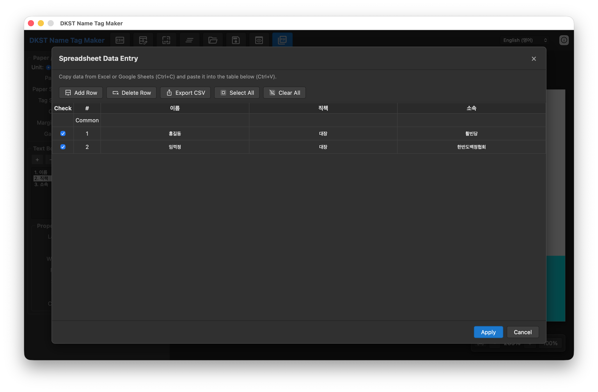
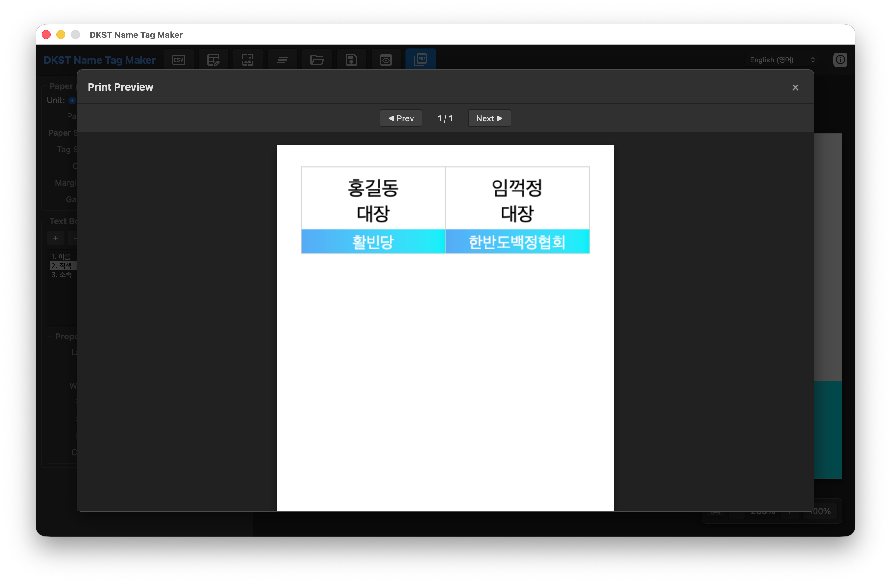

<!-- Created by DINKIssTyle on 2026. Copyright (C) 2026 DINKI'ssTyle. All rights reserved. -->

# DKST Name Tag Maker (DKST 명찰 제작기)

DKST Name Tag Maker는 CSV 데이터나 스프레드시트에서 복사한 데이터를 기반으로 대량의 명찰 및 라벨을 손쉽게 디자인하고 생성할 수 있는 데스크톱 애플리케이션입니다.

DKST Name Tag Maker is a desktop application that allows you to easily design and generate bulk name tags or labels based on CSV data or data copied from spreadsheets.


<div align="center">
  
  
  
</div>
---

## 🌟 주요 기능 (Key Features)

- **데이터 연동 (Data Integration)**: CSV 파일을 가져오거나 엑셀/구글 시트의 데이터를 직접 복사하여 붙여넣을 수 있습니다.
- **자유로운 레이아웃 설정 (Flexible Layout Settings)**: 용지 크기(A4, A3, 사용자 정의), 명찰 크기, 열/행 수, 여백 및 간격을 세부적으로 조절할 수 있습니다.
- **디자인 템플릿 (Design Templates)**:
  - 텍스트 박스 추가/삭제 및 위치(드래그 앤 드롭 지원) 조정
  - 시스템 폰트 활용, 크기, 색상, 정렬, 자간/행간 설정
  - 배경 이미지 지정 기능
- **실시간 미리보기 (Real-time Preview)**: 실제 인쇄될 결과물을 실시간으로 확인하며 디자인할 수 있습니다. (줌 및 페이지 넘기기 지원)
- **출력 및 저장 (Output & Export)**:
  - 고해상도 PDF 저장 기능
  - 프로젝트 저장(.ntag) 및 불러오기 지원
  - 편집된 데이터를 다시 CSV로 내보내기
- **다국어 및 단위 지원 (Multilingual & Unit Support)**: 한국어와 영어를 지원하며, mm와 inch 단위를 선택할 수 있습니다.

---

## 🚀 사용 방법 (How to Use)

### 1. 용지 및 레이아웃 설정 (Paper & Layout Settings)
- 좌측 상단의 **'용지 / 네임태그 설정'** 탭에서 용지 종류와 명찰의 레이아웃을 설정합니다.
- 배경 이미지가 필요한 경우 **'배경 이미지'** 버튼을 클릭하여 이미지를 불러옵니다.

### 2. 데이터 입력 (Data Entry)
- **'스프레드시트'** 버튼을 클릭하여 데이터 입력 창을 엽니다.
- 엑셀이나 구글 시트에서 데이터를 복사(Ctrl+C)한 후, 테이블에 붙여넣습니다(Ctrl+V).
- 각 열의 데이터는 텍스트 박스 설정에서 `{1}`, `{2}` 등의 플레이스홀더를 통해 연결됩니다.

### 3. 텍스트 박스 디자인 (Text Box Design)
- **'텍스트 박스'** 탭에서 항목을 추가하거나 속성을 변경합니다.
- 캔버스에서 텍스트 박스를 직접 드래그하여 위치를 옮길 수 있습니다.
- 라벨 항목에 `{1}`, `{2}`를 입력하면 스프레드시트의 해당 열 데이터가 동적으로 삽입됩니다.

### 4. PDF 저장 및 인쇄 (Save & Print)
- 우측 하단의 **'PDF 저장'** 버튼을 눌러 결과물을 생성합니다.
- 생성된 PDF 파일을 열어 프린터로 인쇄합니다.

---

## 🛠 빌드 방법 (How to Build)

이 프로젝트는 [Wails](https://wails.io/) 프레임워크를 사용하여 제작되었습니다. 빌드를 위해서는 Go와 Wails CLI가 설치되어 있어야 합니다.

This project is built using the [Wails](https://wails.io/) framework. To build it, you need to have Go and Wails CLI installed.

### 필수 요구 사항 (Prerequisites)
- [Go](https://golang.org/dl/) (1.18+)
- [Node.js](https://nodejs.org/) & npm
- [Wails CLI](https://wails.io/docs/gettingstarted/installation)

### 개발 모드 실행 (Development Mode)
```bash
wails dev
```

### 프로덕션 빌드 (Production Build)

각 운영체제에 맞는 스크립트를 사용하거나 직접 명령어를 입력하세요.

**macOS:**
```bash
./build-macOS.sh
# 또는 직접 실행
wails build -platform darwin/universal -clean
```

**Windows:**
```cmd
build-Windows.bat
# 또는 직접 실행
wails build -platform windows/amd64 -clean
```

**Linux (Ubuntu):**
```bash
./build-Linux.sh
# 또는 직접 실행
wails build -platform linux/amd64 -clean
```

---

## 📄 라이선스 (License)

Created by **DINKIssTyle** on 2026.  
Copyright (C) 2026 **DINKI'ssTyle**. All rights reserved.
